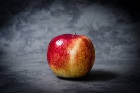
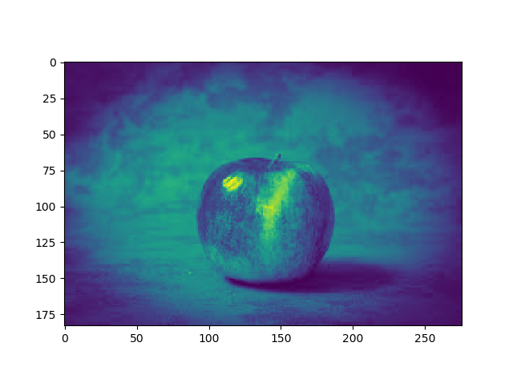
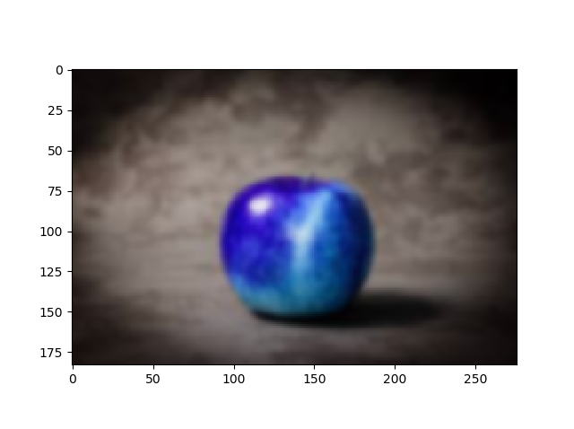
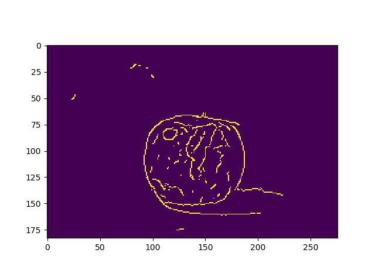
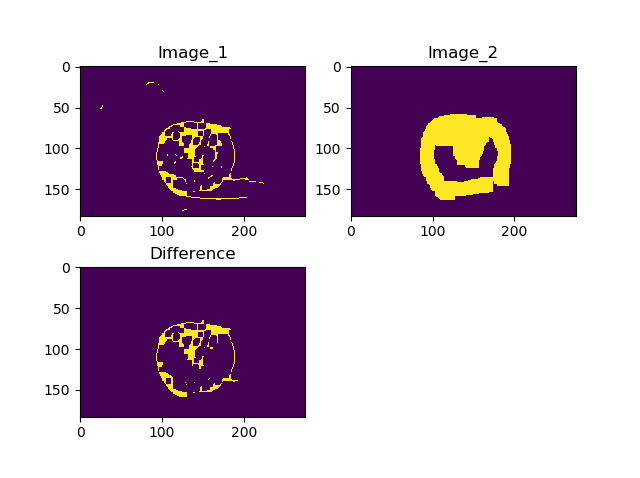
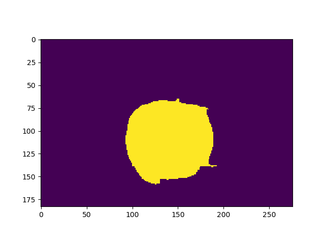
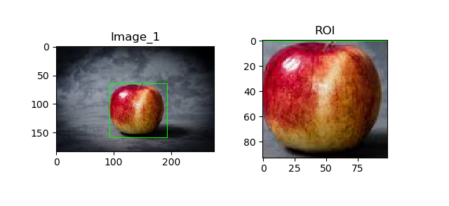
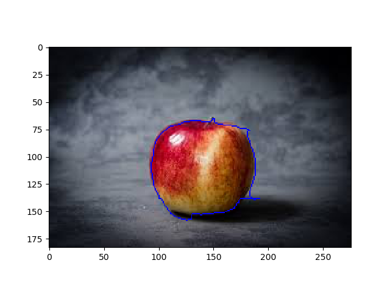
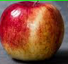
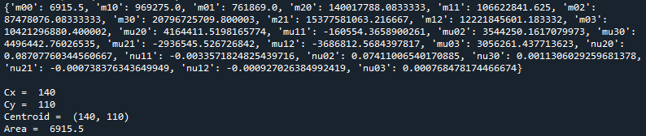

# Region-extraction-from-an-RGB-image
## Summary
A sample program for extracting a specific region from an RGB image using openCV and python. Bounding-box information, actual contour information and other physical parameters such as centroid, area… etc are also calculated. 

### Intial RGB image is uploaded. (By default instead of RGB, its BGR)

### RGB image is converted to grayscale image

### The grayscale image is undergoes blurring using “GaussianBlur()” functionality.

### The blurred image is used for detecting edges. “Canny()” function is used for this purpose.

### To remove unwanted edges and close the gaps, morphological transformations using OpenCV are applied. Here the canny image undergoes two transformations.
### At first, the image undergoes a closing operation and secondly, the same canny image undergoes dilation and erosion. By using 'and' operator into these results provide effective removal of unwanted noises.

### Floodfill functionality is used to fill up the void as shown below:

### The output undergoes thresholding and using "findContours" functionality, the contours can be found out.
### Bounding rectangle is detected for each contour using OpenCV “boundingRect()”.

### The actual countour of the region can also be saved using "imutils.grab_contours()" functionality.

### Final ROI is saved separately along with other physical parameters.

 

### By saving ROI in this manner can be used to create a database for generating synthetic image dataset

